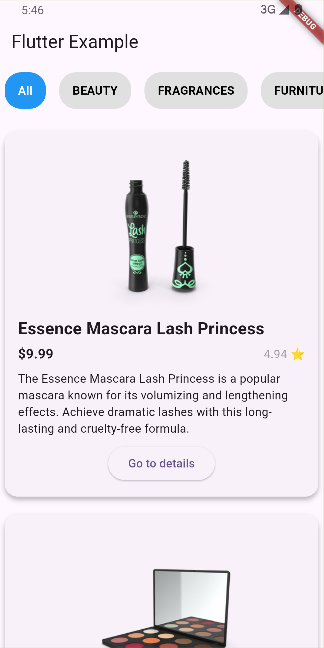
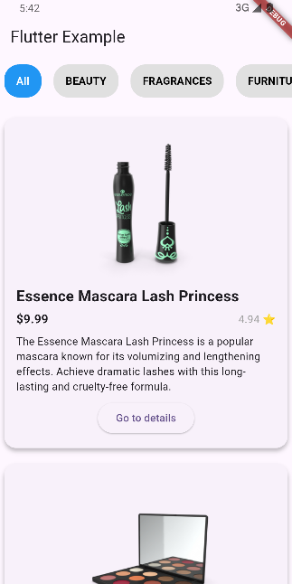
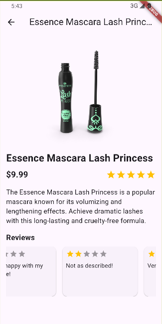
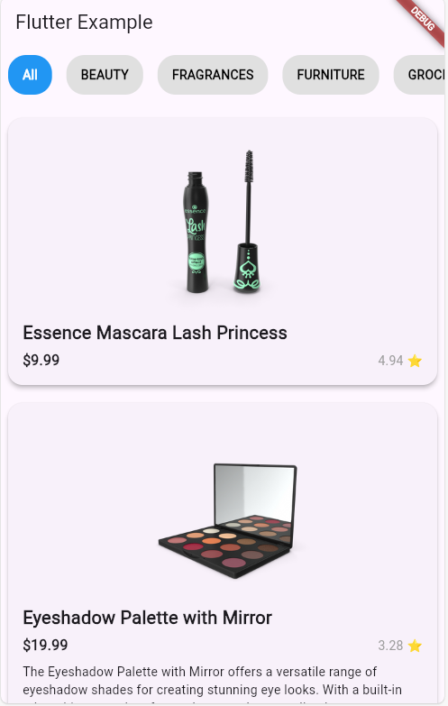
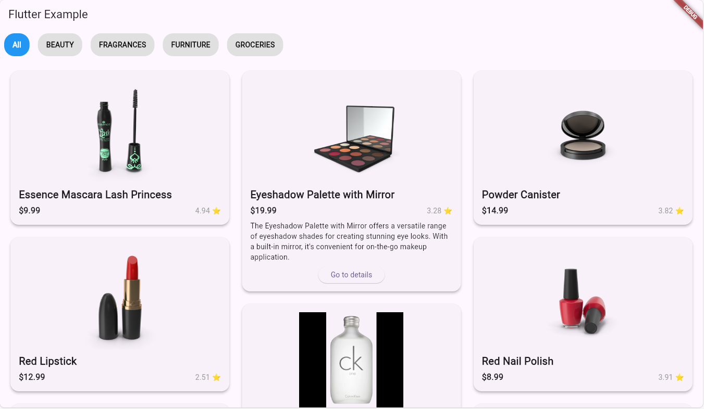
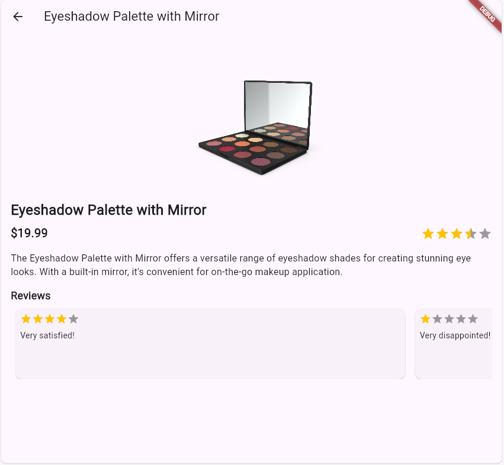

# flutter_products_api

Project Overview:

This project was created by Chiril Grituc as a demonstration of Flutter development skills. The app integrates with the [DummyJSON API](https://dummyjson.com/products) to fetch and display product information dynamically.

It features a responsive UI built with Flutter's Material Design principles, offering an intuitive user experience. While the app focuses on showcasing features such as API integration, filtering, and dynamic layouts, the current implementation can be further modularized and optimized for cleaner architecture.

Features:

Grid Layout: Displays products using a grid view powered by the flutter_staggered_grid_view package, ensuring a responsive and visually appealing design.

Carousel Slider: Highlights featured products with a carousel view for better engagement.

Ratings Display: Implements flutter_rating_bar to show product ratings in a user-friendly manner.

API Integration: Fetches real-time product data from the DummyJSON API using the http package.

Category Filtering: Allows users to filter products by category dynamically.

Expandable Cards: Expands product cards to reveal detailed information.

Back-to-Top Button: Provides a smooth scrolling experience to the top of the page.

Key Libraries:

Material Design: Flutter's toolkit for building responsive and modern UIs.

flutter_staggered_grid_view: Provides flexible and adaptive grid layouts.

carousel_slider: Displays an interactive image carousel.

flutter_rating_bar: Enables customizable star-based ratings for products.

http: Facilitates HTTP requests for fetching product data from the API.

dart:convert: Parses JSON responses into usable Dart objects.

Mobile view:

Web View:

